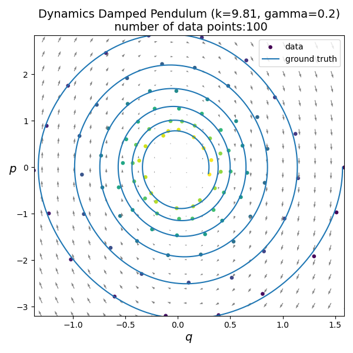
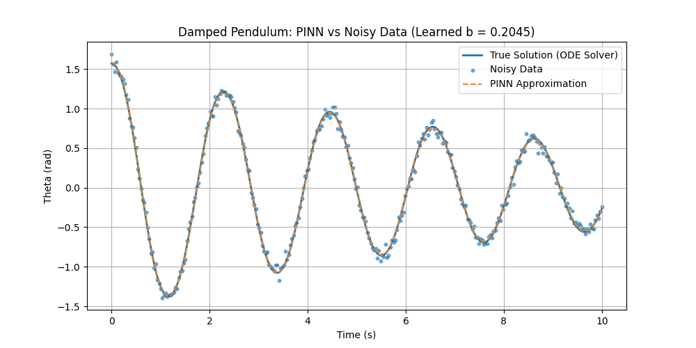
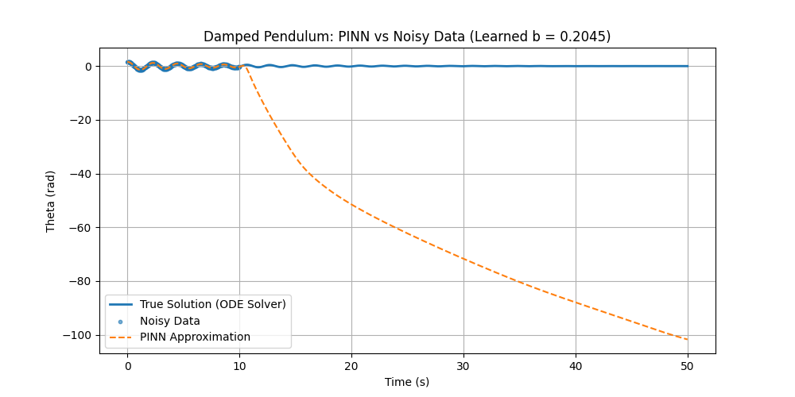
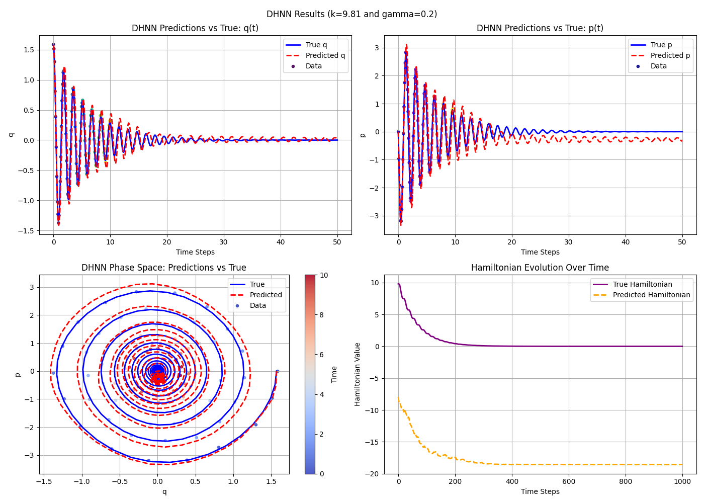

<h1 align="center">PINNs, LNNs & HNNs</h1>
<h3 align="center">The Beauty of Invariants in Scientific Machine Learning</h3>

<p align="center">
  <strong>Imola Fodor</strong> · <strong>Simon Hirländer</strong><br>
  <a href="https://github.com/MathPhysSim/PINNs_LNNs_HNNs">Paris Lodron University of Salzburg · Department of Artificial Intelligence and Human Interfaces</a>
</p>

<p align="center">
  <a href="https://www.python.org/downloads/"></a>
  <a href="https://pytorch.org/"></a>
  <a href="LICENSE"></a>
</p>

<p align="center">
  <em>Created for the <a href="https://sarl-plus.github.io/reinforcement_learning_coffee/"><strong>RL Coffee</strong></a> — a monthly informal meetup on Reinforcement Learning,<br>
  held every first Friday of the month at <a href="https://www.plus.ac.at">Paris Lodron University of Salzburg (PLUS)</a>.<br>
  Presented on <strong>3 January 2025</strong> and <strong>7 February 2025</strong> as <em>"Structured Models in RL"</em>.</em>
</p>

---

## Table of Contents

- [Overview](#overview)
- [Mathematical Background](#mathematical-background)
  - [Physics-Informed Neural Networks (PINNs)](#physics-informed-neural-networks-pinns)
  - [Hamiltonian Neural Networks (HNNs)](#hamiltonian-neural-networks-hnns)
  - [Dissipative Hamiltonian Neural Networks (D-HNNs)](#dissipative-hamiltonian-neural-networks-d-hnns)
- [Project Structure](#project-structure)
- [Installation](#installation)
- [Quick Start](#quick-start)
- [Results](#results)
- [References](#references)
- [Citation](#citation)
- [License](#license)

---

## Overview

This repository provides implementations and experiments comparing three paradigms for learning dynamical systems with *structure-preserving inductive biases*:

| Method | Key Idea | Best Suited For |
|--------|----------|-----------------|
| **PINNs** | Embed governing PDEs/ODEs directly in the loss function | General differential equations, dissipative systems |
| **HNNs** | Learn a scalar Hamiltonian; dynamics via symplectic gradient | Conservative systems with energy preservation |
| **D-HNNs** | Extend HNNs with a Rayleigh dissipation function | Non-conservative systems with energy dissipation |

The central insight is that **structuring your function approximator to respect physical invariants** (energy conservation, symplecticity, dissipation structure) dramatically improves generalization and long-term prediction stability — even with limited, noisy data.

---

## Mathematical Background

### Physics-Informed Neural Networks (PINNs)

PINNs incorporate known physical laws into the learning process by adding a *physics residual* to the loss function. For the **damped pendulum**:

$$\frac{d^2\theta}{dt^2} + \gamma \frac{d\theta}{dt} + \frac{g}{L} \sin(\theta) = 0$$

where $\theta$ is angular displacement, $\gamma$ is the damping coefficient, $g$ is gravitational acceleration, and $L$ is the pendulum length.

The PINN loss combines a data-fitting term with the physics residual:

$$\mathcal{L} = \underbrace{\frac{1}{N}\sum_{i=1}^{N} \|\theta_{\text{NN}}(t_i) - \theta_{\text{obs}}(t_i)\|^2}_{\text{Data Loss}} + \lambda \underbrace{\frac{1}{M}\sum_{j=1}^{M} \|r(t_j;\, \theta_{\text{NN}})\|^2}_{\text{Physics Loss}}$$

where $r(t;\, \theta_{\text{NN}})$ is the ODE residual evaluated using automatic differentiation.

**Advantages:** Data-efficient; generalizes beyond training points; robust to noise via physics regularization.

**Limitation:** No structural guarantee on long-term energy behavior.

### Hamiltonian Neural Networks (HNNs)

HNNs learn a scalar function $H(q, p)$ — the Hamiltonian — and derive dynamics through the *symplectic gradient*:

$$\dot{q} = \frac{\partial H}{\partial p}, \qquad \dot{p} = -\frac{\partial H}{\partial q}$$

This structure **guarantees energy conservation** by construction, since:

$$\frac{dH}{dt} = \frac{\partial H}{\partial q}\dot{q} + \frac{\partial H}{\partial p}\dot{p} = \frac{\partial H}{\partial q}\frac{\partial H}{\partial p} - \frac{\partial H}{\partial p}\frac{\partial H}{\partial q} = 0$$

**Advantages:** Implicit conservation laws; superior long-term stability; interpretable learned Hamiltonian.

### Dissipative Hamiltonian Neural Networks (D-HNNs)

D-HNNs extend HNNs to handle **non-conservative systems** by decomposing the vector field into:

1. A **conservative** component from a Hamiltonian $H(q, p)$ (symplectic gradient)
2. A **dissipative** component from a Rayleigh function $D(q, p)$ (standard gradient)

$$\dot{\mathbf{x}} = \underbrace{J \nabla H(\mathbf{x})}_{\text{Conservative}} + \underbrace{\nabla D(\mathbf{x})}_{\text{Dissipative}}$$

where $J$ is the symplectic matrix. This decomposition is a learnable Helmholtz–Hodge decomposition of the vector field.

---

## Project Structure

```
PINNs_LNNs_HNNs/
├── Damped_pendulum_PINN_and_HNNs.ipynb   # Main notebook: PINN vs HNN vs D-HNN
├── Inverted pendulum PINN.ipynb           # PINN for the inverted pendulum
├── Figures/                               # Result visualizations
│   ├── Damped_pendulum_dhnn_data.png
│   ├── Damped_pendulum_PINN_vs_Noisy.png
│   ├── Damped_pendulum_PINN_vs_Noisy_long.png
│   └── DHNN.png
├── weights/                               # Pre-trained model weights
│   ├── hamiltonian_nn_model.pth
│   ├── hnn_weights.pth
│   ├── lnn_weights.pth
│   └── nnn_weights.pth
├── dissipative_hnn/                       # D-HNN implementation (Sosanya & Greydanus, 2022)
│   ├── models.py                          #   DHNN, HNN, MLP architectures
│   ├── train.py                           #   Training loop and hyperparameters
│   ├── data.py                            #   Synthetic spiral field generation
│   ├── numeric.py                         #   Numerical Helmholtz decomposition
│   └── utils.py                           #   Integration and serialization
├── hamiltonian_nn/                        # HNN implementation (Greydanus et al., 2019)
│   ├── hnn.py                             #   HNN and PixelHNN models
│   ├── nn_models.py                       #   MLP and Autoencoder architectures
│   └── utils.py                           #   RK4 integrator and utilities
├── requirements.txt
├── LICENSE
└── README.md
```

---

## Installation

```bash
# Clone the repository
git clone https://github.com/MathPhysSim/PINNs_LNNs_HNNs.git
cd PINNs_LNNs_HNNs

# Create a virtual environment (recommended)
python -m venv .venv
source .venv/bin/activate  # macOS/Linux

# Install dependencies
pip install -r requirements.txt
```

---

## Quick Start

Open the main notebook to explore the comparison between PINNs, HNNs, and D-HNNs on the damped pendulum:

```bash
jupyter notebook "Damped_pendulum_PINN_and_HNNs.ipynb"
```

Or explore the inverted pendulum PINN:

```bash
jupyter notebook "Inverted pendulum PINN.ipynb"
```

---

## Results

### Training Data

The damped pendulum trajectory used for training:



### PINN Predictions

The PINN trained on noisy pendulum data — good fit within the training window:



### Generalization Test

Extrapolating beyond the training window reveals poor generalization of the PINN:



### D-HNN Predictions

The Dissipative Hamiltonian Neural Network maintains physical consistency even far beyond the training data:



> **Key takeaway:** Structuring the neural network to respect the underlying physics (Hamiltonian + dissipation) yields dramatically better generalization than encoding physics only through the loss function.

---

## References

1. **Greydanus, S., Dzamba, M. & Yosinski, J.** (2019). *Hamiltonian Neural Networks.* NeurIPS 2019.
   [arXiv:1906.01563](https://arxiv.org/abs/1906.01563)

2. **Sosanya, A. & Greydanus, S.** (2022). *Dissipative Hamiltonian Neural Networks: A Physics-Inspired Multitask Learning Framework.*
   [arXiv:2201.10085](https://arxiv.org/abs/2201.10085)

3. **Raissi, M., Perdikaris, P. & Karniadis, G.E.** (2019). *Physics-Informed Neural Networks: A Deep Learning Framework for Solving Forward and Inverse Problems Involving Nonlinear PDEs.* Journal of Computational Physics, 378, 686–707.

4. **Cranmer, M., Greydanus, S., Hoyer, S. et al.** (2020). *Lagrangian Neural Networks.*
   [arXiv:2003.04630](https://arxiv.org/abs/2003.04630)

---

## Citation

If you use this repository in your research, please cite:

```bibtex
@misc{fodor2024pinns_lnns_hnns,
  author       = {Fodor, Imola and Hirl{\"a}nder, Simon},
  title        = {{PINNs, LNNs \& HNNs}: The Beauty of Invariants in Scientific Machine Learning},
  year         = {2024},
  publisher    = {GitHub},
  howpublished = {\url{https://github.com/MathPhysSim/PINNs_LNNs_HNNs}},
}
```

---

## License

This project is licensed under the [MIT License](LICENSE).

**Acknowledgments:** The `hamiltonian_nn` and `dissipative_hnn` modules are based on the original implementations by [Sam Greydanus](https://greydanus.github.io/) and [Andrew Sosanya](https://scholar.google.com/citations?user=RM3NXJAAAAAJ).
