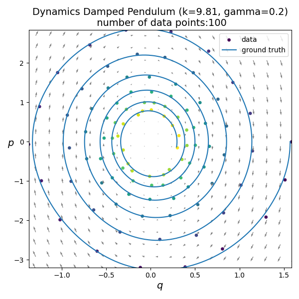

# PINNs_LNNs_HNNs
## The beauty of invariants in Scientific ML
**Created by Imola and Simon for the RL coffee**

Welcome to our **PINNs_LNNs_HNNs** repository—an open space for sharing ideas, insights, and experiments related to:
- **Physics-Informed Neural Networks (PINNs)**
- **Lagrangian Neural Networks (LNNs)**
- **Hamiltonian Neural Networks (HNNs)**

Our goal is to explore and explain scientific machine learning. We encourage open discussion, collaboration, and contributions from anyone interested in applying these advanced neural network frameworks to real-world and theoretical problems.

## Physics-Informed Neural Networks (PINNs) for the Damped Pendulum

### Introduction
Physics-Informed Neural Networks (PINNs) are a class of neural networks that incorporate physical laws, typically represented by differential equations, into the learning process. Unlike traditional neural networks, which rely solely on data, PINNs leverage known physical principles to improve generalization and efficiency, particularly in cases with limited data availability.

### The Damped Pendulum
The damped pendulum is a classic example of a nonlinear dynamical system. It consists of a mass \( m \) attached to a rod of length \( L \), swinging under the influence of gravity and subject to a damping force.

The equation of motion for the damped pendulum is given by:

\[\frac{d^2\theta}{dt^2} + \gamma \frac{d\theta}{dt} + \frac{g}{L} \sin(\theta) = 0\]

where:
- \( \theta \) is the angular displacement,
- \( \gamma \) is the damping coefficient,
- \( g \) is the acceleration due to gravity,
- \( L \) is the length of the pendulum.

This equation is nonlinear due to the \( \sin(\theta) \) term, making it challenging to solve analytically in general cases.

### Applying PINNs
A Physics-Informed Neural Network (PINN) can be used to approximate the solution to this equation by incorporating the governing differential equation into the loss function. The approach involves:

1. **Neural Network Representation**: A neural network with parameters \( \theta_{NN} \) is designed to approximate the function \( \theta(t) \).
2. **Loss Function Definition**:
   - **Data Loss**: If some observational data is available, a mean squared error (MSE) loss can be used to minimize the difference between predicted and observed values.
   - **Physics Loss**: The residual of the governing equation is computed using automatic differentiation to ensure compliance with physical laws.
3. **Training**:
   - The network is trained using standard optimization techniques (e.g., Adam or L-BFGS).
   - The total loss is the weighted sum of data loss and physics loss.

The PINN minimizes both the observed data error and the physics residual, ensuring that the learned function satisfies the governing equations even in regions where no data is available.

### Advantages of PINNs for the Damped Pendulum
- **Data Efficiency**: PINNs require fewer data points as they incorporate physical knowledge.
- **Generalization**: They generalize well beyond training points as they enforce physical constraints.
- **Handling Noisy Data**: The physics loss acts as a regularizer, making PINNs robust to noise in measurements.

## Moving to Hamiltonian Neural Networks (HNNs)
Hamiltonian Neural Networks (HNNs) offer an alternative approach to learning dynamical systems, particularly when the system is conservative or has a known Hamiltonian structure. Unlike PINNs, which explicitly enforce physical laws through the loss function, HNNs learn the underlying energy function governing the system dynamics.

### Differences Between HNNs and PINNs
- **Physical Constraint Enforcement**:
  - PINNs explicitly impose the governing differential equations in the loss function.
  - HNNs learn the Hamiltonian function, indirectly enforcing conservation laws.
- **Applicability**:
  - PINNs can be applied to dissipative systems like the damped pendulum.
  - HNNs are more suited for conservative systems where energy conservation plays a key role.
- **Computational Complexity**:
  - PINNs require automatic differentiation to compute physics residuals.
  - HNNs leverage learned Hamiltonians and symplectic gradients, often leading to better stability in long-term predictions.

### Advantages of HNNs
- **Implicit Conservation Laws**: Since HNNs learn the Hamiltonian, they inherently conserve energy in conservative systems.
- **Better Long-Term Prediction**: HNNs often yield more stable solutions over extended time horizons compared to PINNs.
- **Interpretability**: The learned Hamiltonian function provides insights into the underlying system dynamics.

## Conclusion
PINNs and HNNs offer distinct advantages depending on the system being studied. While PINNs are well-suited for general differential equations, including dissipative systems like the damped pendulum, HNNs excel in modeling conservative systems where energy preservation is crucial. Choosing between the two depends on the nature of the system and the desired properties of the learned model.

## Getting Started
The main scripts are:

[Inverted pendulum PINN.ipynb](Inverted%20pendulum%20PINN.ipynb)

[Damped_pendulum_PINN_and_HNNs.ipynb](Damped_pendulum_PINN_and_HNNs.ipynb)   

git clone https://github.com/MathPhysSim/PINNs_LNNs_HNNs.git

## Some insights
The data:

The PINN trained on the pendulum:

We see poor generalisation on unseen data:

and with a dissipative hamiltonian neural network:

### This demonstrates the power of structuring your function approximator at hand